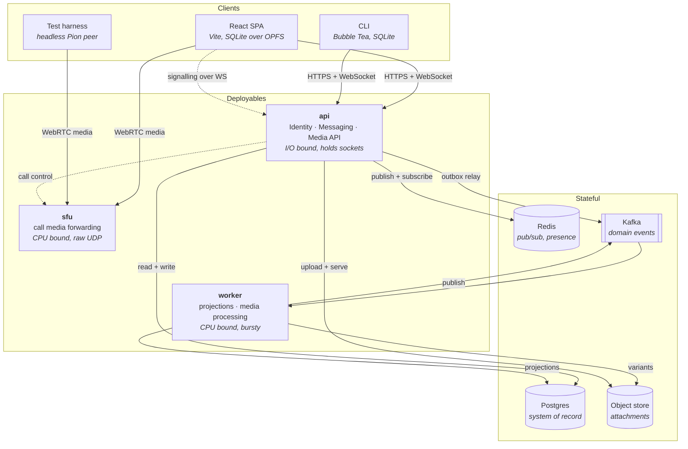

# Architecture

How the running system is put together, and which rules hold it in shape. Decisions are recorded in [ADRs](./adr/); this document describes the result.

## Containers



Note what the diagram does **not** show: no arrow from Kafka to a client. Kafka never touches the delivery path — that is Redis's job, and the separation is deliberate ([ADR-0005](./adr/0005-redis-pubsub-for-socket-fanout.md)).

## Why three deployables

Split by resource profile, not by bounded context ([ADR-0007](./adr/0007-modular-monolith-split-by-resource-profile.md)):

| Binary | Shape | Scales on |
|--------|-------|-----------|
| `api` | I/O bound, thousands of idle long-lived sockets, low CPU | concurrent connections |
| `worker` | CPU bound, bursty, restartable at will, holds no connections | queue depth |
| `sfu` | CPU bound and latency-critical, needs a raw UDP port range, cannot be load-balanced by HTTP | concurrent calls |

Bounded contexts live *inside* `api` as packages. A boundary violation is a build failure, enforced by import linting — not a network call.

## The two paths

Every write follows both, and confusing them is the mistake this design most wants to prevent.

**Durable path** — Postgres commit, outbox row in the same transaction, relay publishes to Kafka, consumers project. Ordered, replayable, at-least-once, idempotent consumers. Everything that must not be lost goes here: projections, receipts, push notifications, media work.

**Ephemeral path** — Redis Pub/Sub, per account, subscribed only by the node holding that account's sockets. At-most-once and best-effort. Getting a message onto a screen *now* goes here.

The ephemeral path is allowed to fail. When it does, the client notices a gap in sequence numbers and refetches from Postgres. That reconciliation is required for offline sync anyway, so it is one mechanism doing two jobs rather than a fallback bolted on ([ADR-0003](./adr/0003-postgres-is-truth-kafka-carries-events.md)).

## Data ownership

One context owns each table. No context reads another's tables — cross-context references are IDs, and cross-context reactions are events.

| Context | Owns |
|---------|------|
| Identity | accounts, handles, credentials, devices |
| Messaging | conversations, memberships, entries, cursors, receipts, reactions, outbox |
| Media | attachments, variants |
| Calling | calls, participants |

Calling needs to know whether an account may join a call, which is a Messaging question. It asks Messaging, in process, through a published port — it does not read `memberships`.

## Layering inside a context

Standard ports-and-adapters, one direction of dependency. Each context exposes one
package and hides its layers behind a nested `internal/`, which the compiler makes
unreachable from outside — so the layer packages keep short names and no import in
the repository needs an alias ([ADR-0011](./adr/0011-nested-internal-fences.md)):

```
internal/messaging/
    messaging.go            package messaging   ← the only public surface
    internal/
        api/                package api         HTTP, WebSocket, hub
            ↓
        app/                package app         use cases, clock, identifiers, events
            ↓
        domain/             package domain      aggregates, ports  ← depends on nothing
            ↑
        postgres/  broadcast/                   implement domain ports
```

The model imports no framework, no driver, and no other context. Two rules protect
this, and only one of them is a test:

- **The compiler** refuses any import of `internal/<context>/internal/...` from
  outside that context, including from `cmd/`. Nothing outside Messaging can name a
  Messaging aggregate, repository or table.
- **The architecture test** covers what the compiler cannot say: the model imports
  only the standard library, and no context imports another's public facade.

Because `cmd/api` cannot name the packages a context is built from, each context
owns its own composition root — `identity.New(db, logger)`. That leaves `cmd/api`
doing only what it should: choosing which contexts exist and how they are joined.

## CQRS, precisely scoped

Only Messaging. The write model is the entry log with its invariants; the read models are cursors, unread counts and receipts, projected asynchronously from Kafka. Identity is CRUD, Media is a pipeline, Calling is ephemeral state — applying CQRS to any of them would be ceremony.

This is **CQRS without event sourcing**. Entries are real rows and the log is queried directly. Events describe what happened so read models can react; they are not the source of truth.

## Kafka topics

| Topic | Key | Carries |
|-------|-----|---------|
| `messaging.entries` | conversation id | entry appended, entry revised |
| `messaging.receipts` | conversation id | delivered, read |
| `media.attachments` | attachment id | upload accepted, variants ready, processing failed |
| `identity.accounts` | account id | account registered, credential added, device registered, device revoked, session started, session rotated (from phase 3 — until then these events are recorded by aggregates and written to the log) |

Keying entry and receipt topics by conversation gives per-conversation ordering, which is the only ordering that means anything — sequence numbers are meaningless across conversations.
