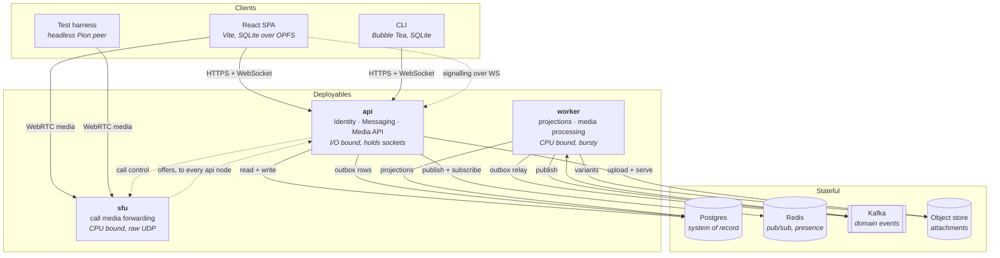
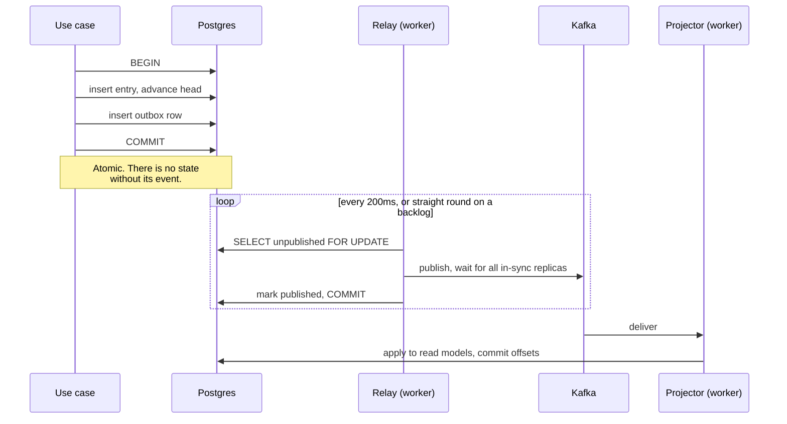
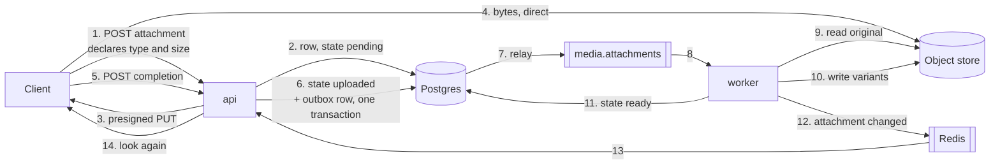

# Architecture

How the running system is put together, and which rules hold it in shape. Decisions are recorded in [ADRs](./adr/); this document describes the result.

## Containers



Note what the diagram does **not** show: no arrow from Kafka to a client. Kafka never touches the delivery path — that is Redis's job, and the separation is deliberate ([ADR-0005](./adr/0005-redis-pubsub-for-socket-fanout.md)).

## Why three deployables

Split by resource profile, not by bounded context ([ADR-0007](./adr/0007-modular-monolith-split-by-resource-profile.md)):

| Binary | Shape | Scales on |
|--------|-------|-----------|
| `api` | I/O bound, thousands of idle long-lived sockets, low CPU | concurrent connections |
| `worker` | CPU bound, bursty, restartable at will, holds no connections | queue depth |
| `sfu` | CPU bound and latency-critical, needs a raw UDP port range, cannot be load-balanced by HTTP | concurrent calls |

Bounded contexts live *inside* `api` as packages. A boundary violation is a build failure, enforced by import linting — not a network call.

## The two paths

Every write follows both, and confusing them is the mistake this design most wants to prevent.

**Durable path** — Postgres commit, outbox row in the same transaction, relay publishes to Kafka, consumers project. Ordered, replayable, at-least-once, idempotent consumers. Everything that must not be lost goes here: projections, receipts, push notifications, media work.

**Ephemeral path** — Redis Pub/Sub, per account, subscribed only by the node holding that account's sockets. At-most-once and best-effort. Getting a message onto a screen *now* goes here.

The ephemeral path is allowed to fail. When it does, the client notices a gap in sequence numbers and refetches from Postgres. That reconciliation is required for offline sync anyway, so it is one mechanism doing two jobs rather than a fallback bolted on ([ADR-0003](./adr/0003-postgres-is-truth-kafka-carries-events.md)).

Call signalling is on neither. It is request and response between a client and the node holding its socket, plus one hop to `sfu` — and the offers coming back the other way, which are the one thing in the system that needs to reach a *particular* socket from a process that holds none ([ADR-0013](./adr/0013-media-node-broadcasts-its-offers.md)).

## Data ownership

One context owns each table. No context reads another's tables — cross-context references are IDs, and cross-context reactions are events.

| Context | Owns |
|---------|------|
| Identity | accounts, handles, credentials, devices |
| Messaging | conversations, memberships, entries, cursors, receipts, reactions, outbox |
| Media | attachments, variants |
| Calling | calls, participants |

Calling needs to know whether an account may join a call, which is a Messaging question. It asks Messaging, in process, through a published port — it does not read `memberships`.

## Layering inside a context

Standard ports-and-adapters, one direction of dependency. Each context exposes one
package and hides its layers behind a nested `internal/`, which the compiler makes
unreachable from outside — so the layer packages keep short names and no import in
the repository needs an alias ([ADR-0011](./adr/0011-nested-internal-fences.md)):

```
internal/messaging/
    messaging.go            package messaging   ← the only public surface
    internal/
        api/                package api         HTTP, WebSocket, hub
            ↓
        app/                package app         use cases, clock, identifiers, events
            ↓
        domain/             package domain      aggregates, ports  ← depends on nothing
            ↑
        postgres/  broadcast/                   implement domain ports
```

The model imports no framework, no driver, and no other context. Two rules protect
this, and only one of them is a test:

- **The compiler** refuses any import of `internal/<context>/internal/...` from
  outside that context, including from `cmd/`. Nothing outside Messaging can name a
  Messaging aggregate, repository or table.
- **The architecture test** covers what the compiler cannot say: the model imports
  only the standard library, and no context imports another's public facade.

Because `cmd/api` cannot name the packages a context is built from, each context
owns its own composition root — `identity.New(db, logger)`. That leaves `cmd/api`
doing only what it should: choosing which contexts exist and how they are joined.

## CQRS, precisely scoped

Only Messaging. The write model is the entry log with its invariants; the read models are cursors, unread counts and receipts, projected asynchronously from Kafka. Identity is CRUD, Media is a pipeline, Calling is ephemeral state — applying CQRS to any of them would be ceremony.

This is **CQRS without event sourcing**. Entries are real rows and the log is queried directly. Events describe what happened so read models can react; they are not the source of truth.

## Kafka topics

| Topic | Key | Carries |
|-------|-----|---------|
| `messaging.entries` | conversation id | entry appended, entry revised |
| `messaging.receipts` | conversation id | delivered, read |
| `media.attachments` | attachment id | upload accepted |
| `identity.events` | device id, or account id where there is no device | account registered, credential added, device registered, device revoked, session started, session rotated |

Keying entry and receipt topics by conversation gives per-conversation ordering, which is the only ordering that means anything — sequence numbers are meaningless across conversations.

Identity's topic is keyed by **subject** rather than uniformly by account: the device where an event has one, the account otherwise. Session does not model an account — it belongs to a device — and adding one to the aggregate to satisfy a partitioning scheme would let the transport dictate the model. The ordering that results is per-device, which is what Messaging relies on when it disconnects a revoked device. Account-level events are not ordered against device-level ones, and nothing needs them to be.

Receipts have their own topic rather than sharing `messaging.entries`. Someone scrolling a year of history produces a burst of cursor advances; behind entries on one topic, that burst would delay the projection of new messages — the badge that matters most held up by the badges being cleared.

`media.attachments` is a work queue rather than a stream of facts other contexts observe, and it carries one event. Readiness and failure were on it in the original design and are not: their only purpose is to reach an open socket, Redis is already the socket fanout, and a client that misses the notification discovers the change on the next fetch — so a durable event with no durable consumer would be a promise nothing needs. It is keyed by attachment rather than by conversation, because two uploads in one conversation have nothing to say to each other and processing them in parallel is the point.

Attachments also get their own consumer group. Deriving variants from a large photo occupies a consumer for as long as it takes to decode, and sharing a group with the projections would make every unread badge in the system wait behind it.

## The outbox

Publishing to Kafka from a use case cannot be made correct. The state change and the publish are two commits against two systems, and whichever order they are attempted in, a crash between them either loses the event or announces something that did not happen.

So an event is written to an `outbox` row **in the same transaction** as the change it describes, and a relay publishes it afterwards:



What that buys and what it costs:

- **At-least-once, never at-most-once.** A crash between the publish and the mark republishes the row. Exactly-once is not available — it is the same two-systems problem one layer up — so consumers are idempotent (NF-8) rather than the pipeline being exact.
- **Ordered per key.** The relay claims rows with `FOR UPDATE`, not `SKIP LOCKED`. Skipping locked rows would let a second relay publish row 20 while the first still holds 19, reordering two events for one conversation. One relay at a time is the price of ordering, and it is recorded as a known ceiling in the code.
- **Kafka being down costs delay, not data.** Rows accumulate and drain on recovery (NF-6).
- **Writing an event outside a transaction is refused**, not reviewed for. It compiles and runs and silently reintroduces exactly the split-brain the outbox exists to prevent.

## Attachments

The one flow where the server opens a payload ([ADR-0001](./adr/0001-content-opaque-server-e2ee-deferred.md)), arranged so that it happens in exactly one process.



**api never holds a byte of it**, in either direction. Step 4 is the client to the store; a viewer's fetch is the store to the client. What api does is sign URLs and answer questions about state.

**The size cap is enforced twice and read nowhere.** The declared size is refused at step 1 if it is over 100 MB, before a URL exists. It is also signed into the URL, so a client that lies is refused by the store on a request api never sees (MD-4).

**The identifier is issued before the bytes exist**, which is the whole point of steps 1–3 being separate from 4. An entry can reference an attachment that is still uploading, so a message carrying a 90 MB video is readable immediately and displayable later (MD-1).

**Idempotency is two constraints, not two code paths.** Completion is idempotent because the aggregate refuses to raise a second job for an upload it has already accepted; variant generation is idempotent because the variants' primary key is `(attachment, name)`, so a second pass overwrites the first (MD-2). And the job cannot be lost, because it is an outbox row in the same transaction as the state change it describes — a crash leaves it uncommitted and redelivered (MD-3).

**Media holds no access rules.** Whether an account may attach, and whether it may view, are asked of Messaging: an attachment is exactly as visible as the entry that references it, which keeps the join-point history policy in the context that owns it. A second copy of that rule here is the thing most likely to drift.

## Projections

`conversation_member_state` holds one row per membership: read mark, delivery mark, unread count. Every write to it is idempotent by construction rather than by a deduplication table — which is what makes replaying the whole topic a safe operation rather than a dangerous one.

| What moves it | How it stays idempotent |
|---|---|
| `entry_appended` increments unread for everyone but the author | a `projected_sequence` guard in the same statement; a redelivered entry has a sequence the row has already counted |
| `cursor_advanced` moves the read mark | `GREATEST`, so a stale or duplicated advance changes nothing — this *is* MS-12's forward-only rule |
| `entries_delivered` moves the delivery mark | `GREATEST`, same reason |
| a cursor advance recomputes the unread count | recomputed from the log rather than decremented, so the answer is exact and does not accumulate error |

MS-12 living in the projection rather than in the aggregate is worth stating plainly: the aggregate cannot enforce forward-only because it does not hold the cursor, and reading the projection to validate a write against it would be a race dressed up as a check. Taking the greater of the two makes ordering irrelevant — so the forward-only rule and idempotent redelivery turn out to be one mechanism, not two.

Delivery state (MS-13) is derived from two integers per membership, not stored per entry per recipient. A row per entry per recipient would be the fan-out-on-write ADR-0002 rejected, wearing a different hat.

A record that can never be applied — no identifiers, an undecodable payload — is logged and skipped rather than retried. At-least-once plus a deterministic failure is an infinite retry, and one bad record would otherwise stop every projection behind it on that partition, indefinitely. A transient failure, such as Postgres being unreachable, is still returned and retried. That distinction was found by running the worker, not by reasoning about it.
