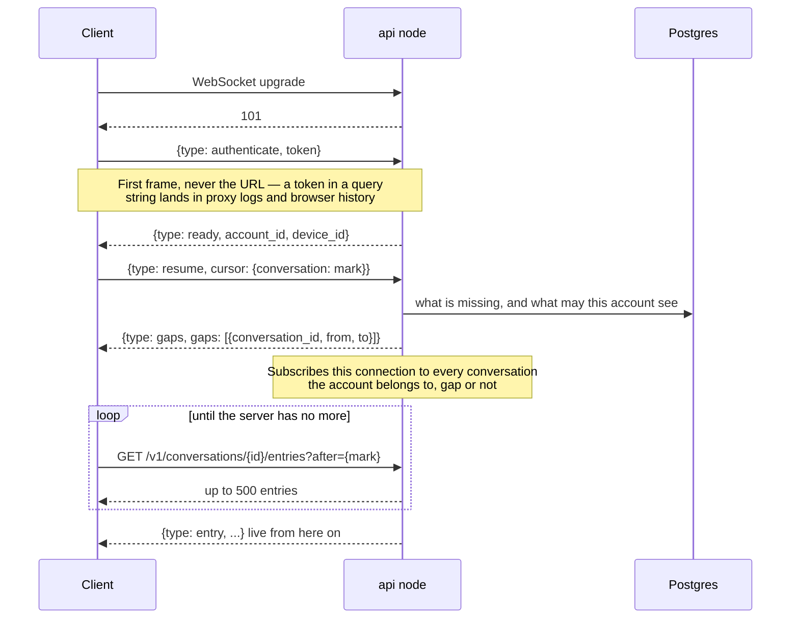
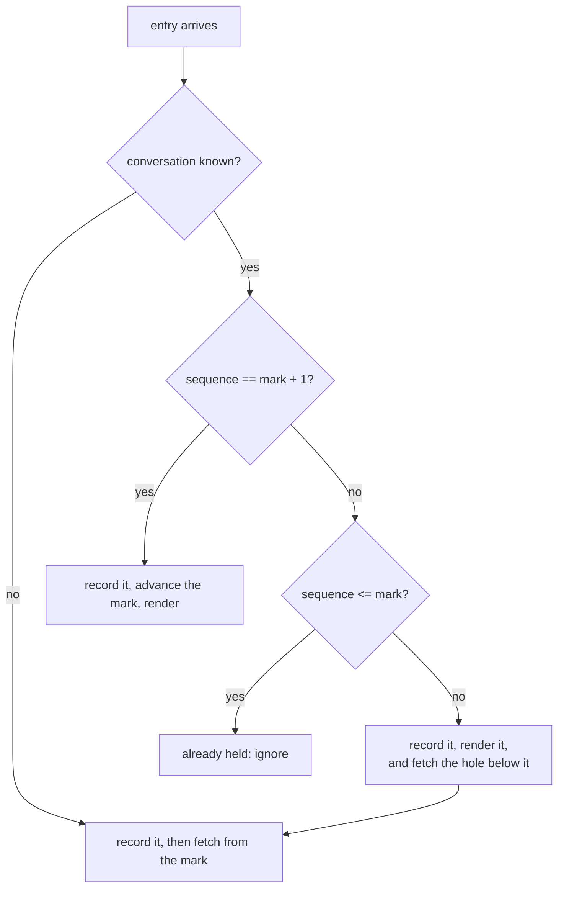

# The client sync contract

What every client must do to not lose messages. Written down because there will be two of them — the browser client and phase 6's CLI — and a rule implemented differently in each is a rule that holds in neither.

The one sentence worth memorising:

> **Live delivery is an optimisation. Gap detection is the delivery guarantee.**

Redis Pub/Sub is at-most-once and allowed to drop a broadcast ([ADR-0005](./adr/0005-redis-pubsub-for-socket-fanout.md)). A client that treats the socket as a complete stream will lose messages silently, with nothing anywhere reporting an error. Every rule below follows from that.

## The contiguous mark

Each conversation has one number: the highest sequence with **nothing missing below it**.

Holding entries 1, 2 and 7, the mark is 2 — not 7. Resuming from 7 would abandon 3 through 6 permanently, because sync runs strictly forward and nothing would ever ask for them again.

Two rules move the mark, and nothing else may:

1. **A contiguous arrival advances it.** Holding 1 and 2, entry 3 arrives, the mark becomes 3 — and continues climbing through anything already held above it.
2. **A fetch that skips positions closes over them.** Asking for what follows 0 and being handed 40 first means 1 to 39 are not this account's to see, or do not exist. The server is authoritative about the shape of the log, so the mark becomes 39.

Rule 2 is not an optimisation. Without it a member who joined a conversation at position 40 treats the history before their join point as a permanent gap, refetches it on every entry, and never converges. That case is covered by a test named for it.

## The handshake

Conversations absent from the cursor read as zero, so a first-ever connection and a reconnection after a month send the same frame. There is no special case for either.

A conversation with no entries at all appears in no gap. Clients learn about those from `GET /v1/conversations`, which is why the list is fetched as well as the socket being opened.

## Reacting to a live entry

The entry above a hole is **kept and rendered**, not discarded. It is a real message and withholding it until the fetch completes would make a dropped broadcast look like a message that never arrived.

## Duplicates are normal

The same entry legitimately arrives up to three times: over the socket, in the response to its own send, and again in any fetch spanning it. Keying local state by sequence number makes all three the same entry, with no comparison logic and no window in which a message shows twice.

This is also why the sender's own message needs no special handling. It is inserted from the send response at its assigned position, and the broadcast of it lands on the same key.

## Retrying a send

The client-supplied identifier belongs to the **draft**, not to the attempt. A send that fails and is tried again must carry the same one, so the server recognises the retry and returns the entry the first attempt created rather than writing a second (MS-2).

The failure this prevents is specific: the request succeeded and the *response* was lost. The client cannot tell that apart from a request that never arrived, so it must be safe under both.

## Losing the connection

- **The network goes away.** A socket whose network has gone is not closed by anything — it stops carrying traffic while still reporting itself open. Clients must treat a known-lost network as a lost connection immediately, or they sit reporting themselves live and current when they are neither. In a browser that is the `offline` event.
- **The network comes back.** Reconnect at once rather than serving out a backoff delay earned while there was no point trying.
- **Reconnecting.** Exponential backoff with jitter to a ceiling, so a node restarting does not have every client it dropped return in the same instant.
- **Events outlive their socket.** A closed connection reports its close after its replacement exists. Handlers must check they still belong to the current socket, or a stale close will discard the live connection and leave the old one authenticated and orphaned on the server.
- **The server closes for being too slow.** A client whose outbound buffer overflowed is disconnected rather than allowed to consume server memory. Recovery is the ordinary one: reconnect, resume, fill the gap.

Every one of these ends in the same place, which is the point of the design: reconnect and resume from the mark. There is no repair path that exists only for one of them.

## What clients must not do

- **Trust the socket to be complete.** It is not, by design.
- **Advance the mark to the highest sequence held.** That is the bug this document exists to prevent.
- **Persist an entry above a hole as if the hole were filled.** Phase 6 gives clients a durable store; a mark saved optimistically makes the loss permanent across restarts.
- **Modify a stored entry in place.** Edits and deletes arrive as later entries referencing earlier ones ([ADR-0008](./adr/0008-mutations-are-log-entries.md)), which is what lets a client that has already synced past an entry still learn it changed.
