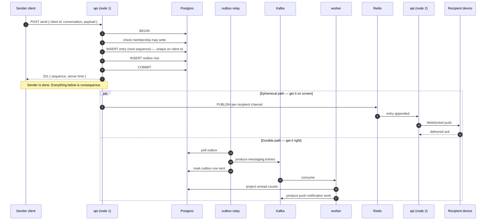
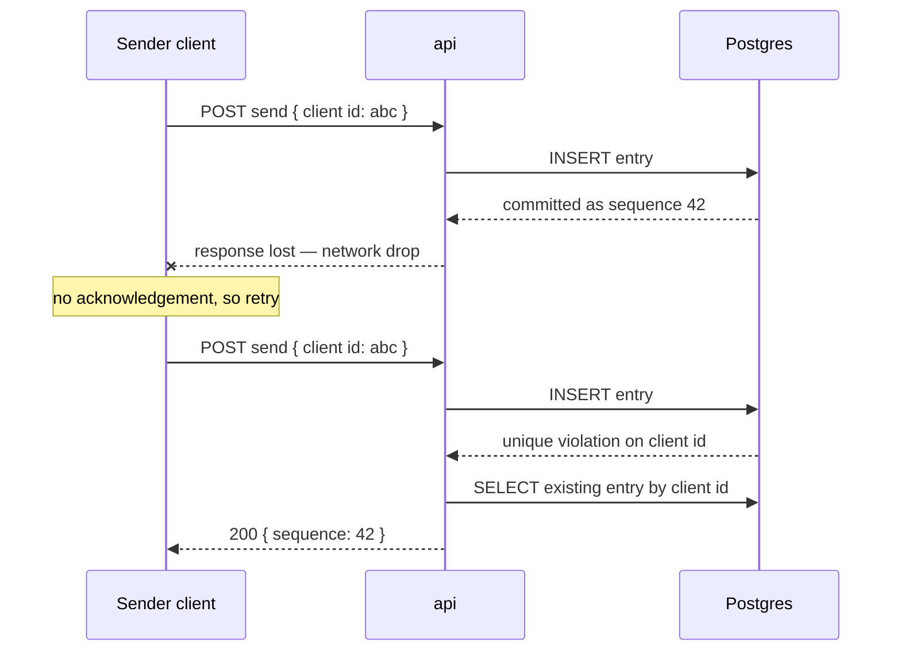
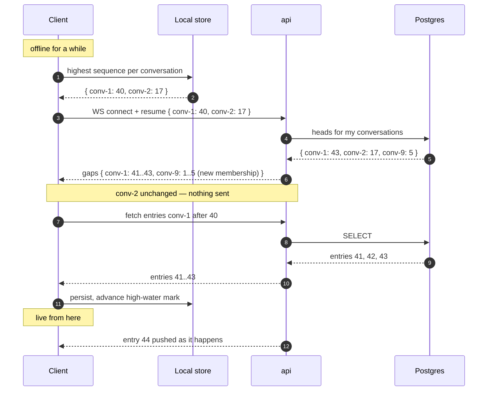
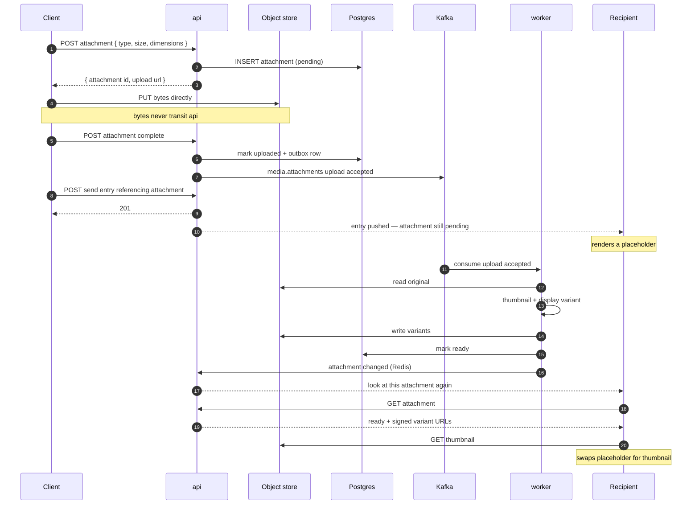

# Flows

Four flows are drawn here, chosen because each one is somewhere the design is not obvious from reading the code. Login, account creation and handle lookup are deliberately absent — they are ordinary request/response and a diagram would add nothing.

## 1. Sending an entry

The core write path. Note that the sender's acknowledgement does **not** wait for Kafka, projections, or the recipient's socket. It waits for the Postgres commit and nothing else.



Two things this drawing is meant to make obvious:

- **The two paths run concurrently and neither depends on the other.** If Redis is down, the recipient sees the entry on next reconnect. If Kafka is down, the entry is already committed and the outbox drains when Kafka returns.
- **The outbox exists because publishing inside the transaction is impossible and publishing after it is a lie.** A crash between commit and produce would lose the event forever. The outbox row is committed atomically with the entry, so the event is guaranteed to be published eventually — at-least-once, which is why every consumer is idempotent ([ADR-0003](./adr/0003-postgres-is-truth-kafka-carries-events.md)).

### Retry



The client-supplied identifier makes retry a lookup instead of a duplicate. Without it, at-least-once delivery over a flaky mobile network produces double-sent messages — which users notice immediately and trust never recovers from.

## 2. Reconnect and gap sync

The flow that makes at-most-once socket delivery acceptable, and the reason sequence numbers are gapless.



Gaplessness is what makes this work. A client holding 40 and told the head is 43 knows *precisely* what it is missing. With ULID or timestamp ordering the best available question would be "give me everything since roughly this time," which is both wasteful and unable to prove nothing was skipped.

The same mechanism covers three separate situations with no extra code: reconnecting after a drop, starting cold on a new device, and being added to a conversation while offline.

## 3. Attachment upload and processing

The one flow where the server deliberately opens a payload ([ADR-0001](./adr/0001-content-opaque-server-e2ee-deferred.md)), and the one where a message is visible before it is displayable.



The entry and its attachment are deliberately decoupled. A message referencing a 90 MB video is readable the instant it is sent; the video becomes displayable when it is ready. Coupling them would mean either blocking the send on transcoding or hiding the message until processing completed — both worse.

Processing must be idempotent, because at-least-once delivery means the worker will occasionally process the same attachment twice, and a crashed worker must leave the job replayable rather than the attachment permanently pending (MD-2, MD-3). Both are constraints rather than code: the job is an outbox row committed with the upload it describes, so a crash leaves it uncommitted and redelivered; and the variants have a primary key of `(attachment, name)`, so a second pass overwrites the first rather than adding to it.

**Readiness goes over Redis, not Kafka.** The original design had the worker publish a `variants ready` event, consume it back, and push from there. What that event would be *for* is reaching an open socket — Redis Pub/Sub is already the socket fanout ([ADR-0005](./adr/0005-redis-pubsub-for-socket-fanout.md)), and a client that misses the notification discovers the change the next time it renders the attachment, which it must fetch anyway for the URLs. A durable event with no durable consumer is a promise nothing needs.

The notification carries no state. Variant URLs are signed and expire within the hour, so a frame containing them would be stale by the time a client acted on it; "look again" is the whole message. This is also why a client cannot use the notification to see something it should not: the frame names an opaque identifier, and the fetch it prompts is authorised by asking Messaging whether the entry referencing that attachment is visible to the asker.

**What the bytes never touch.** The api process signs URLs and serves metadata. It reads no attachment on the way in and proxies none on the way out — the only process that ever holds attachment bytes is the worker, deriving variants off the request path.

## 4. Joining a call

Signalling is domain code and rides the existing WebSocket. Media never touches `api`.

Two `api` nodes here, because that is the case worth drawing: the two people are on different processes and the call belongs to neither of them.

```mermaid
sequenceDiagram
    autonumber
    participant C1 as Caller
    participant A1 as api (node A)
    participant PG as Postgres
    participant SFU as sfu
    participant A2 as api (node B)
    participant C2 as Callee

    C1->>A1: call.join { conversation, offer }
    A1->>PG: may I join? (membership check)
    A1->>PG: INSERT call (ringing) — refused if one is live
    A1->>SFU: join { call, participant, offer }
    SFU-->>A1: answer
    A1-->>C1: call.joined { call, answer, participants }
    A1-->>C2: call changed (via Redis, to whichever node holds them)

    C1->>SFU: ICE + DTLS-SRTP, then publish
    Note over C1,SFU: media bypasses api entirely

    C2->>A2: call.active { conversation }
    A2-->>C2: call.current { ringing }
    C2->>A2: call.join { conversation, offer }
    A2->>PG: participant joined, call active
    A2->>SFU: join { call, participant, offer }
    SFU-->>A2: answer, carrying the caller's tracks
    A2-->>C2: call.joined

    Note over SFU: the callee starts publishing; the caller<br/>negotiated before that track existed
    SFU-->>A1: offer for the caller (broadcast to every node)
    SFU-->>A2: same offer (node B has no socket for it, drops it)
    A1-->>C1: call.offer
    C1->>A1: call.answer
    A1->>SFU: answer
    SFU->>C1: forward the callee's media

    C2->>A2: call.leave
    A2->>SFU: release the participant
    A2->>PG: participant left
    Note over A2,PG: the last participant leaving ends the call
```

There is no separate *start*. A call exists because somebody joined a conversation that had none, so at most one call per conversation is not a rule that has to be enforced — no code path can create a second, and a partial unique index catches two people pressing call in the same instant.

Because entitlement derives entirely from conversation membership, Calling holds no access rules of its own — the check at step 2 is the only authorisation in the flow. An SFU on a public address is its own relay, so there is no separate TURN server here ([ADR-0006](./adr/0006-custom-pion-sfu-with-simulcast.md)).

Steps 17 and 18 are the asymmetry that makes a two-person call work at all, and they are why the media node broadcasts ([ADR-0013](./adr/0013-media-node-broadcasts-its-offers.md)): the offer is produced by a process holding no sockets, for a client whose socket is on a node it cannot name.

**Simulcast** is not in the diagram because it changes nothing about it. A publisher's camera arrives as several qualities on one media section, the server chooses one per receiver and forwards it into the single track that receiver subscribed to, and the choice is revisited whenever a receiver reports what it can take. No extra signalling: a client never learns that the stream it is decoding changed layer, which is what the sequence-number rewriting in `layers.go` is for. A keyframe is requested on every switch, because without one the receiver shows corruption until the next natural one arrives.
